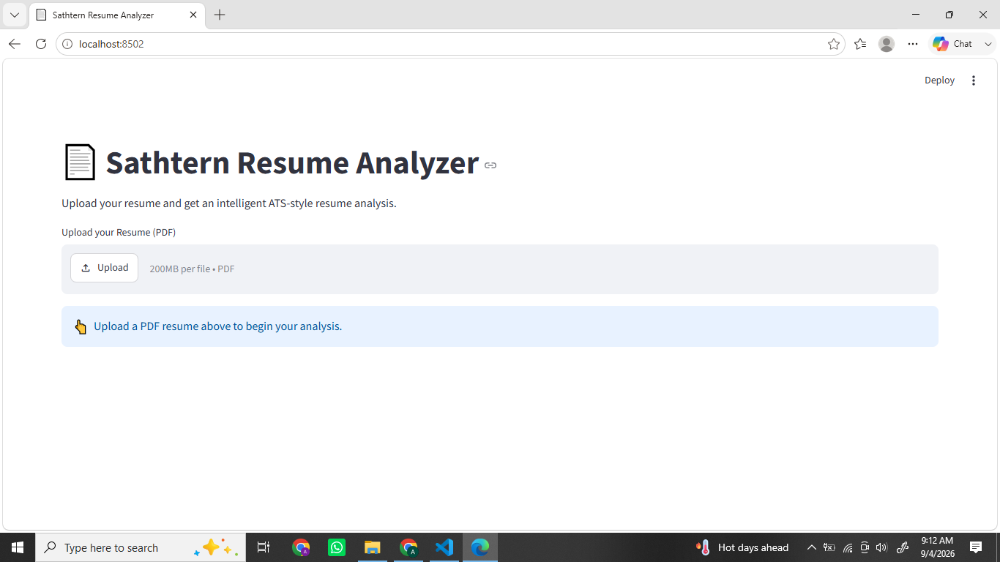
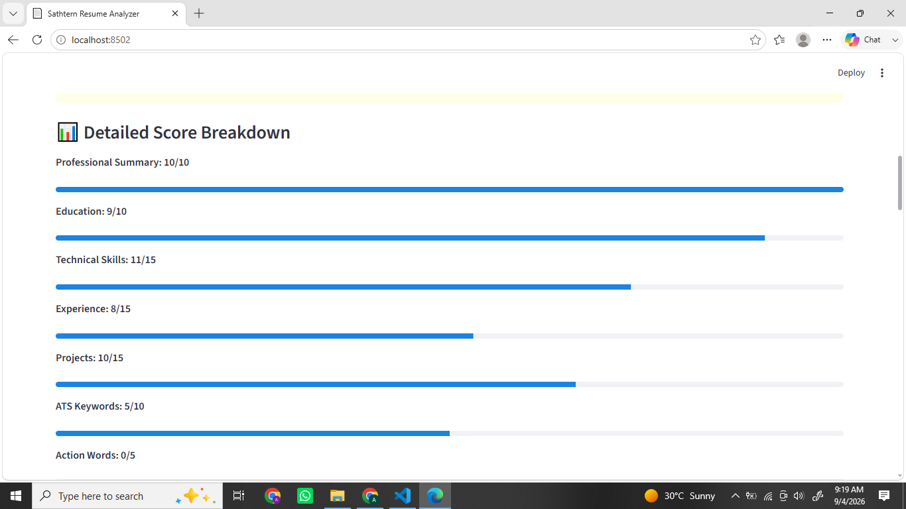
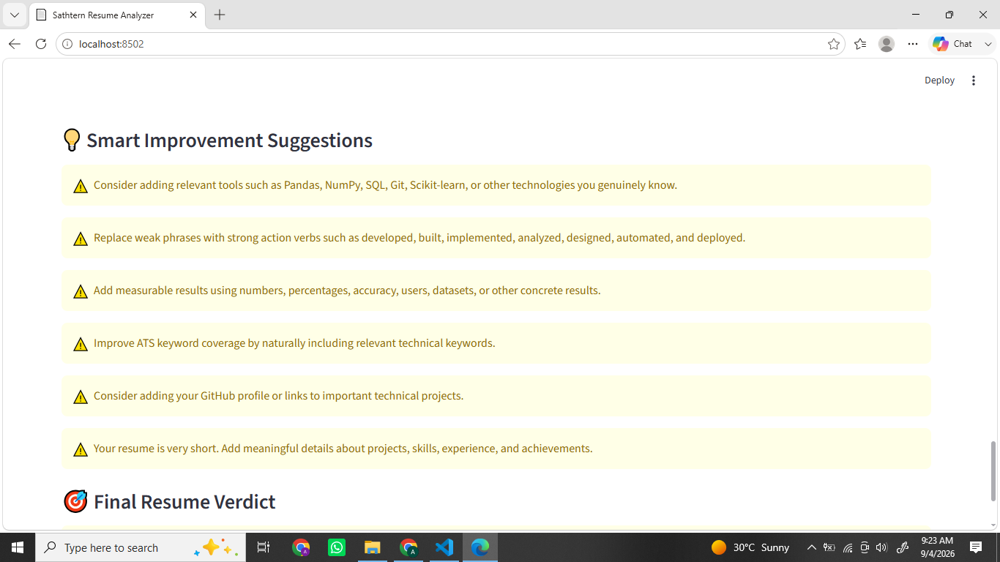
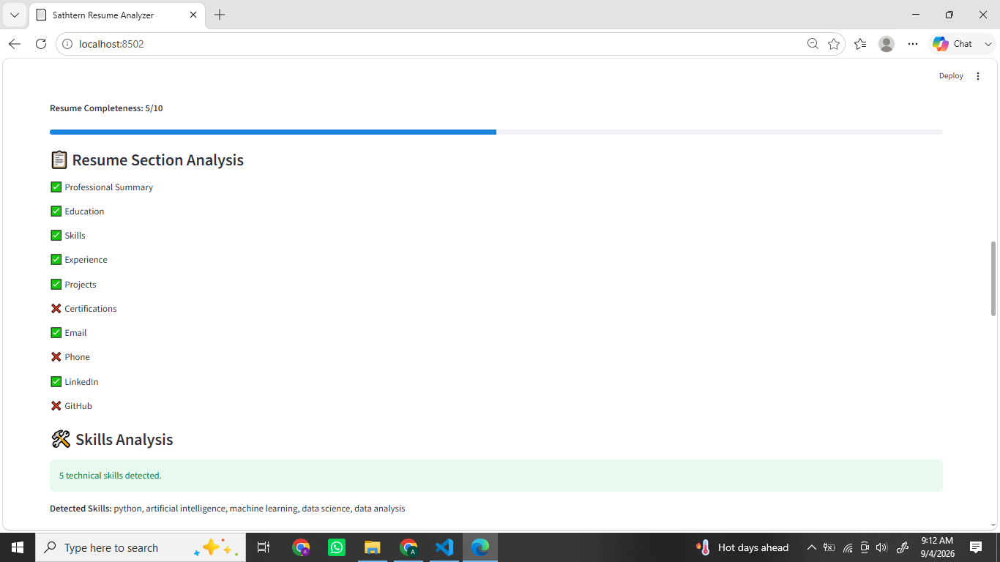

# 📄 Sathtern Resume Analyzer

An intelligent **ATS-style Resume Analyzer** built with Python and Streamlit that evaluates resumes, calculates a score out of 100, identifies strengths and weaknesses, and provides actionable suggestions for improvement.

## 🚀 Features

* 📄 Upload resumes in PDF format
* 🔍 Automatically extract resume text
* 📊 Calculate an overall resume score out of 100
* 📝 Analyze professional summary
* 🎓 Analyze education
* 💻 Detect technical skills
* 💼 Analyze work and internship experience
* 🚀 Analyze projects
* 🏆 Detect certifications
* 📧 Detect contact information
* 🔑 Analyze ATS keywords
* ⚡ Detect strong and weak action words
* 📈 Detect measurable achievements
* 🎓 Provide student-specific resume analysis
* 💡 Generate smart improvement suggestions
* ✅ Provide a final resume verdict

## 🧠 Resume Analysis

The analyzer evaluates multiple important areas of a resume, including:

| Category                | Analysis                        |
| ----------------------- | ------------------------------- |
| 📄 Resume Content       | Overall content quality         |
| 📝 Professional Summary | Presence and quality of summary |
| 🎓 Education            | Education information           |
| 💻 Technical Skills     | Relevant technical skills       |
| 💼 Experience           | Work and internship experience  |
| 🚀 Projects             | Project information             |
| 🏆 Certifications       | Relevant certifications         |
| 🔑 ATS Keywords         | Keyword optimization            |
| ⚡ Action Words          | Strong and weak action verbs    |
| 📈 Achievements         | Measurable accomplishments      |
| 📧 Contact Information  | Essential contact details       |

## 📊 Scoring System

The application generates an overall **Resume Score out of 100** based on the quality and completeness of important resume sections.

The score helps users understand how strong their resume is and which areas need improvement.

## 💡 Smart Suggestions

After analyzing the resume, the application provides personalized suggestions such as:

* Improving the professional summary
* Adding relevant technical skills
* Strengthening project descriptions
* Adding measurable achievements
* Improving ATS keyword usage
* Using stronger action verbs
* Adding missing resume sections

## 🛠️ Technologies Used

* **Python**
* **Streamlit**
* **PyPDF**
* **Regular Expressions (Regex)**

## 📂 Project Structure

```text
Sathtern_Resume_Analyzer/
│
├── app.py
├── requirements.txt
├── README.md
│
├── uploaded_resume_score.png
├── detailed_score_breakdown.png
├── smart_suggestions.png
├── .skills_ats_analysis.png
└── ._main_upload_screen.png
```

## ⚙️ Installation

### 1. Clone the repository

```bash
git clone https://github.com/aleezahramzan256-sys/Sathtern_Resume_Analyzer.git
```

### 2. Navigate to the project directory

```bash
cd Sathtern_Resume_Analyzer
```

### 3. Create a virtual environment

```bash
python -m venv .venv
```

### 4. Activate the virtual environment

**Windows PowerShell:**

```powershell
.\.venv\Scripts\Activate.ps1
```

### 5. Install dependencies

```bash
pip install -r requirements.txt
```

### 6. Run the application

```bash
streamlit run app.py
```

The application will open in your browser.

## 📸 Application Screenshots

### Main Upload Screen



### Resume Score



### Detailed Score Breakdown


### Smart Suggestions



### ATS & Skills Analysis



## 🎯 Project Purpose

The purpose of this project is to help students and job seekers evaluate their resumes using an automated ATS-style analysis system.

It provides an easy-to-understand score and actionable feedback so users can improve their resumes before applying for internships and jobs.

## 👩‍💻 Author

**Aleezah Ramzan**

Artificial Intelligence Undergraduate
The Islamia University of Bahawalpur

## 📌 Internship Project

This project was developed as part of the **Sathtern Virtual Internship Program**.

---

⭐ If you find this project useful, consider giving the repository a star!
